

    <h1>NYC Citi Bike Share Program Analysis</h1>
    <h2><i>Summer 2019 & Winter 2019-20</i></h2>

    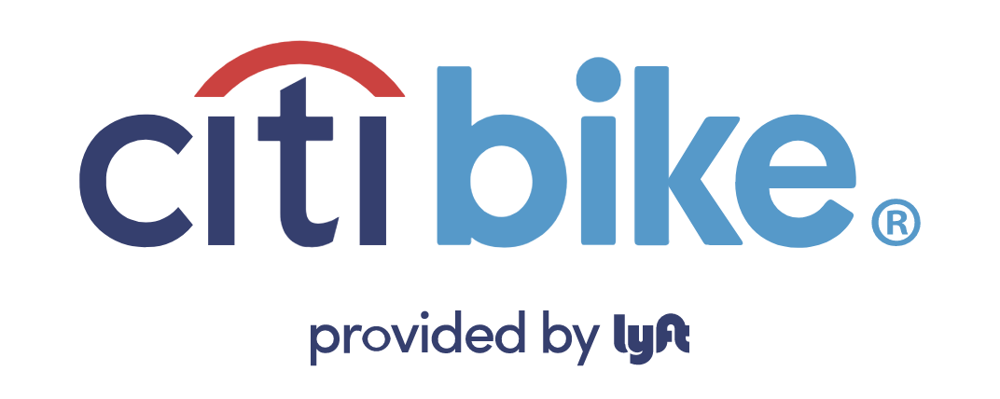

 

<h1>Basic Demographics</h1>

<h2><i>Who are the annual subscribers?</i></h3>
<h3> The annual subscribers are mostly male, with roughly 25% female, and roughly 2% unknown or unspecified.</h3>

    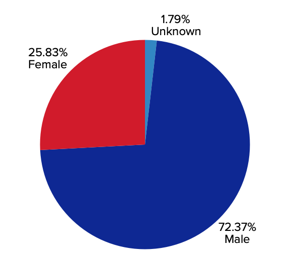

<h3>Subscribers are mostly commuters, as their peak days are weekdays and peak hours are 8 AM & 5 PM.</h3>

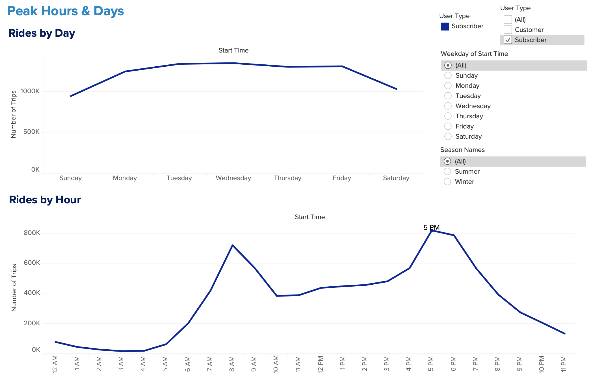

<h2><i>Who are the short-term customers?</i></h2>
<h3>On the other hand, short-term customers are 35% male, 21% female, and 44% unspecified.</h3>

    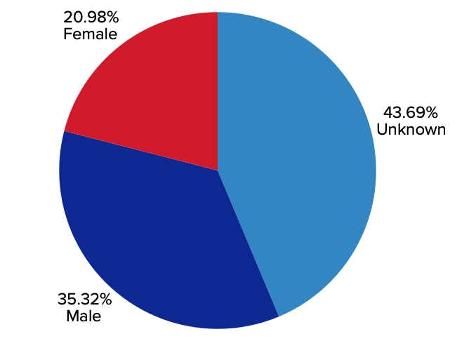

<h3>Short-term customers are mostly tourists as the peak days are weekends and the overall peak hour is 3 PM.</h3>

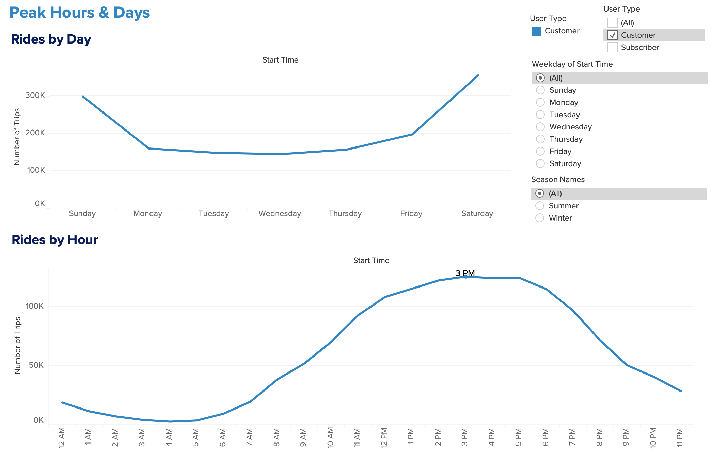

 

    <h1><i>Phenomenons Discovered</i></h1>

## 1. Long Bike Trips: Over 24 hrs
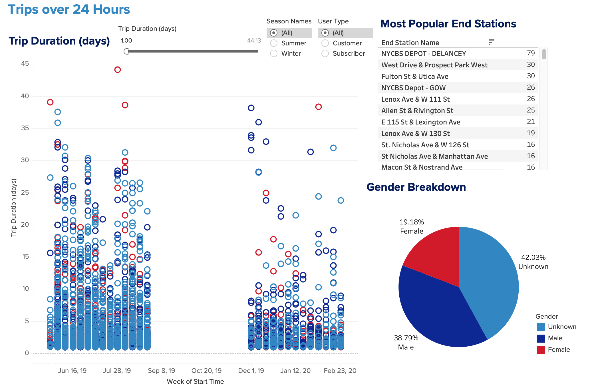

- There are over 2,500 bike trips recorded with a ride duration of 24 hrs+ within the time period.
    - 1,000 of these occurrences are from annual subscribers.
- This trend could either signify that bike riders are not returning the bikes properly, on purpose or by accident, or that these bikes are ones that need to be repaired and are being charged to the last person to use them.
- When the trip duration is filtered to 2 weeks+, the number of bikes out of stations reduces to nearly 200 bikes, with around 150 of those being from short-term customers. 
    - This could be interpreted to mean that short-term customers are more careless with returning the bike than annual subscribers.
- In the *Tableau Story*, the user can interact with the filters to see the breakdown of gender and most frequent end stations as the minimum trip duration is increased, or by choosing to specify by season or user type.

## 2. The Birth Year  of 1969
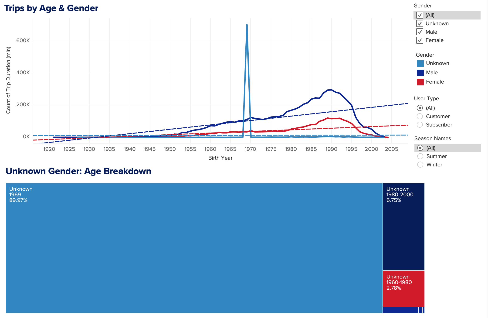

- When looking at the frequency of rides by age, it was quickly apparent that the birth year of 1969 was an outlier in the data.
    - To get a better idea of why this was occuring, the number of rides was split up by gender.

- 98% of the short-term customers with an unspecified gender (and 89.97% of both user types with an unspecified gender) also chose a birth year of 1969, which suggests this was a default value when the customers signed up.
- The best explanation for this trend is that the default demographics when signing up are an unspecified gender and the birth year of 1969.    
    - If customers are in a hurry to ride a bike while signing up, they may not specify their demographics. 
- For analysis purposes, it is best to avoid pulling inferences from this birth year with the other data points since most likely, they are not all individuals born in 1969.

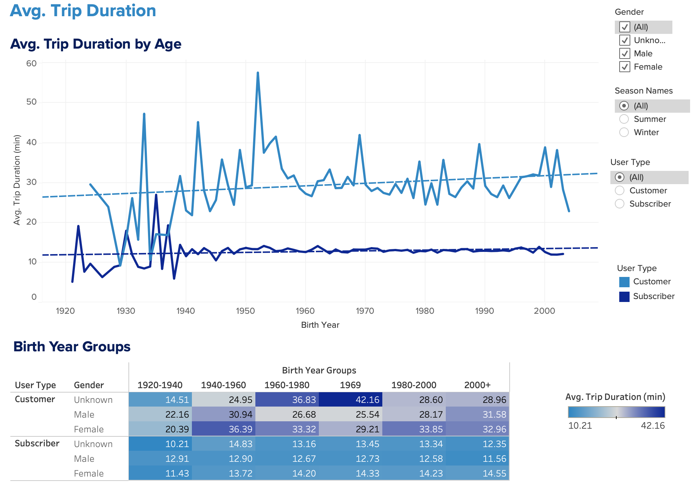

- The average trip durations above, by age, also signify the higher average of ride durations with the age group of 1969.
    - This demographic also includes the highest number of trips of the short-term customers.

<h2><i>Stations Map</i><h2>
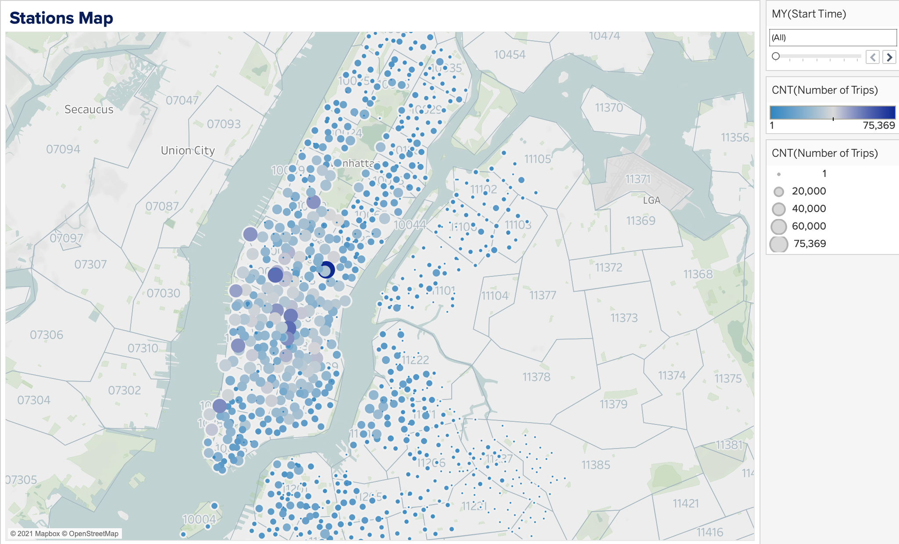

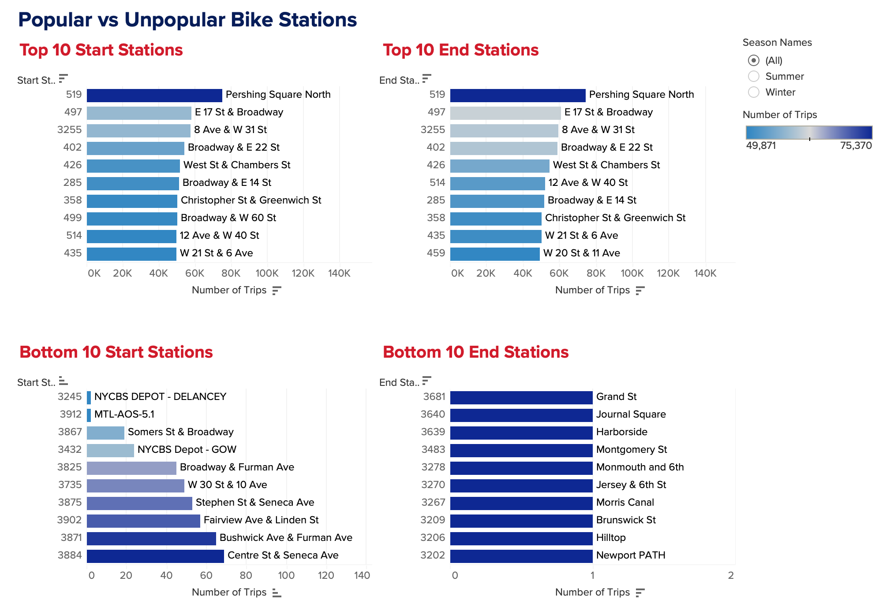

<h3>Top Station: 519 -  Pershing Square North</h3>

    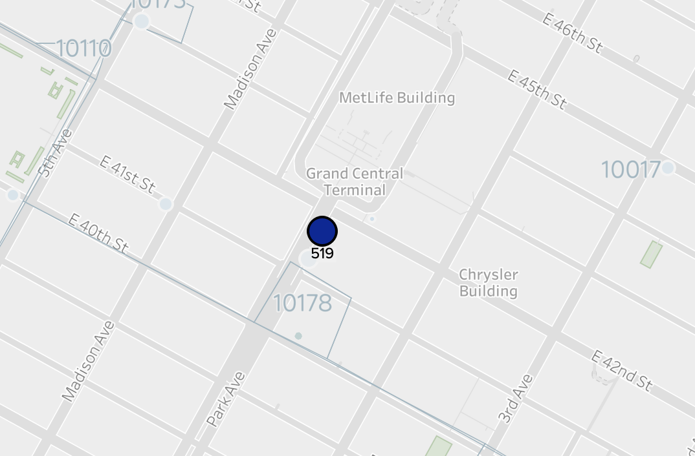

- The most popular station to start a trip and end a trip is pictured above. This station is clearly the most popular since it is the closest bike station to the Grand Central Station terminal, the MetLife Building, and the Chrysler Building.
- As each month goes on, the top 10 popular bike stations change, showing a variability between popular locations in the summer vs. the winter. 
    - However, Station 519 stays the most popular throughout the time period, since it is located near the main hub for NYC.

- Other popular stations include ones near Union Square, Central Park, and Broadway, along with other major commute hubs, such as New York Penn Station.
  - Citi Bike should ensure that the most popular start stations have enough bikes loaded at each location to keep up with the high demand.